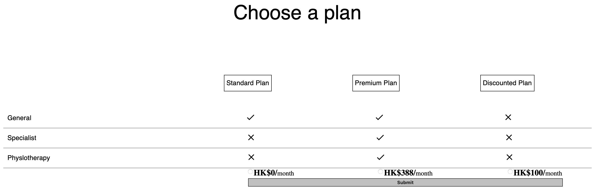

# Plan Selecterd

It is the object for demonstrate a user would like to selected diffierent plan.

## Project install

After clone the project, open the terminal and type

```bash
npm install
npm start
```

## The application


